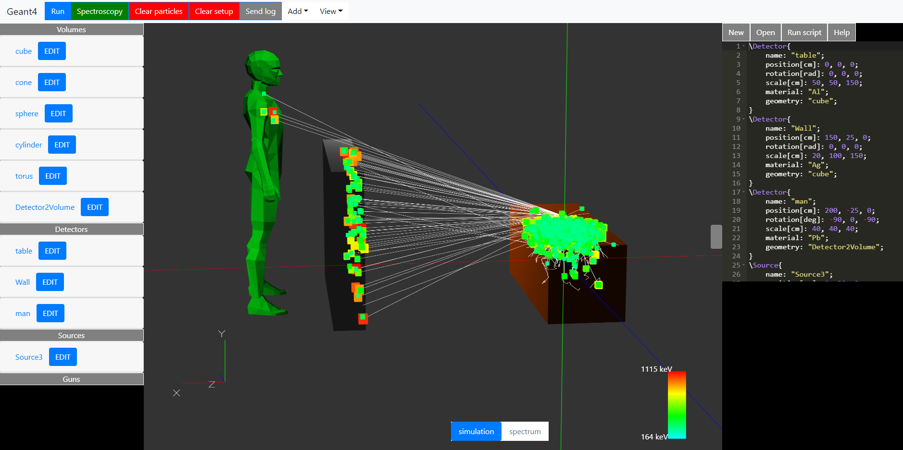
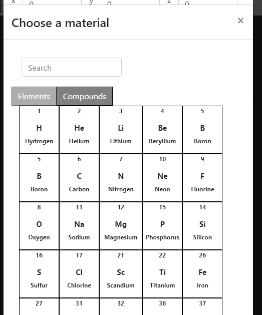
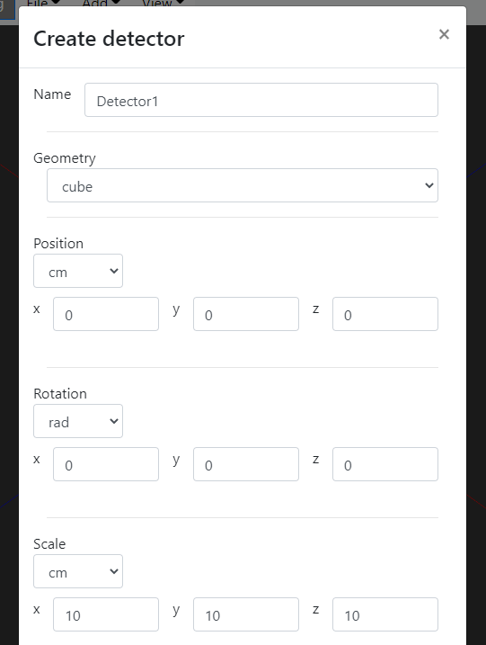
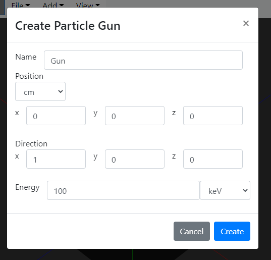
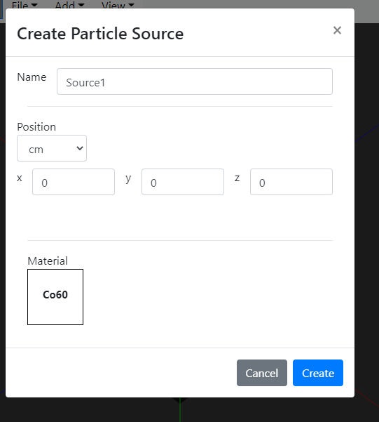

# Radsim
The webapplication provides a web interface for Geant4 simulations. The application only requires a browser with WebGL capabilities. The application is deployed at https://radsim.inf.elte.hu/ .

## User documentation

### 1. User interface

<figure class="image">
  
  <figcaption>The userinterface</figcaption>
</figure>

The UI consists of the following parts:
    - Sidebar for handling detectors and particle sources
    - Canvas the simulation is rendered on
    - Code editor
    - Navigation bar

#### 1.1 Creating detectors

Detectors can be created by choosing the 'Add' option on the navigation bar. The shape of the detector can be of one of the predefined shapes (cube, cone, cylinder ... ) or the user can upload an .STL file. The material of the detector can be choosen from the Geant4 database, it contains both elements and compounds.

<figure class="image">
  
  <figcaption>Dialog for choosing the detectors material</figcaption>
</figure>

<figure class="image">
  
  <figcaption>Dialog for creating detectors</figcaption>
</figure>

#### 1.2 Defining source

Particle sources can be created with particle guns and radioactive sources, both of them can be found in the 'Add' option on the navigation bar. You can define a particle guns position, the direction of the primary particle and its energy. Radioactive sources' materials can be choosen from the Geant4 database.

<figure class="image">
  
  <figcaption>Dialog for creating a particle gun</figcaption>
</figure>

<figure class="image">
  
  <figcaption>Dialog for creating a radioactive source</figcaption>
</figure>

## Changelog

2020/11/11
- added color spectrum gui
- fixed unit bugs

2020/11/09
- added logging
- added testing for the language
- fixed unit bugs
- maximum number of particles is limited
- different spectrum for energy color
- implemented sensitive detectors

2020/09/09
- Better outline

2020/09/08
- Added units of measurement
- Adjusted spectrum diagram
- Volume data and name can be modified
- Fixed some bugs

2020/08/28
- Fixed scroll
- Detector geometry and name can be edited
- Adjusted spectrum diagram
- Added "volumes"

2020/08/17
- Fixed minor bugs
- Added material table

2020/08/13
- Fixed spectrum bins
- Synchronized detector list and language
- Fixed gun direction
- Added measurement units to language
- Fixed minor bugs

2020/08/06
- Added database for storing geometries
- Added custom language
- Added a grid
- Fixed some bugs

2020/07/27
- Fixed id bugs
- Added spectrum navigation
- Backend memory/timeout fix

2020/07/24
- Added code editor
- Fixed camera zoom

